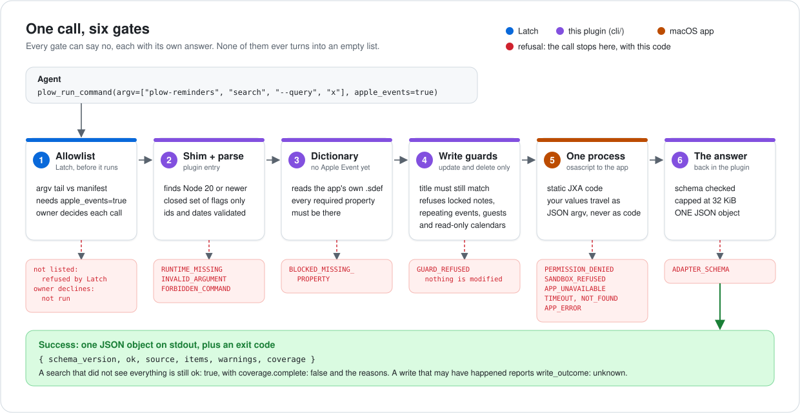
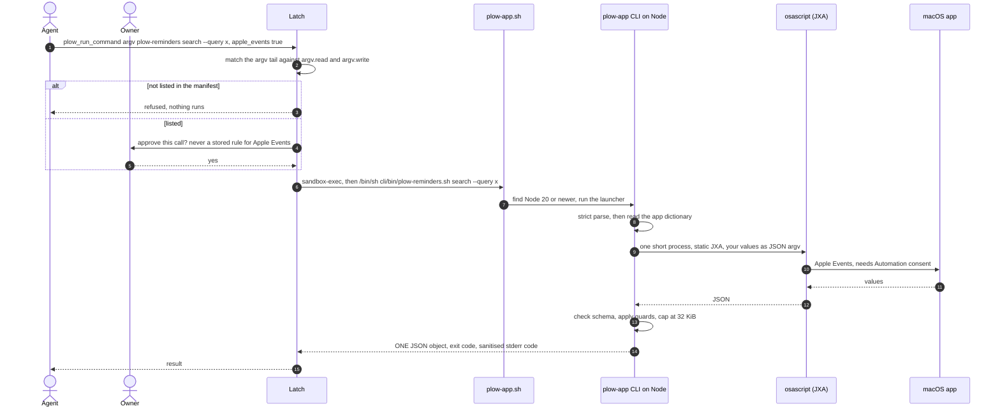

# plow-plugins

[Latch](https://github.com/plow-pbc/latch) plugins that let an agent work with the owner's **Contacts, Reminders, Notes and Calendar** on this Mac, modelled on Latch's [`messages`](https://github.com/plow-pbc/latch/tree/main/apps/desktop/plugins/messages) plugin. Each plugin is its own folder with the three things Latch expects: a CLI, a `latch-plugin.json` manifest, and a `skill.md` that teaches the agent how to use the CLI.

| Plugin | Command | macOS permission | Reads | Writes |
|---|---|---|---|---|
| [`contacts/`](contacts) | `plow-contacts` | `automation:com.apple.AddressBook` | `search`, `show`, `doctor` | none |
| [`reminders/`](reminders) | `plow-reminders` | `automation:com.apple.reminders` | `lists`, `search`, `show`, `doctor` | `create`, `delete` |
| [`notes/`](notes) | `plow-notes` | `automation:com.apple.Notes` | `folders`, `search`, `show`, `doctor` | `create`, `delete` |
| [`calendar/`](calendar) | `plow-calendar` | `automation:com.apple.iCal` | `calendars`, `search`, `show`, `doctor` | `create`, `update`, `delete` |

All four permission keys are ones Latch already knows (`AUTOMATION_APPS`), none needs Full Disk Access, and no plugin has a network path.

**Under Latch, every call that reaches the app must pass `apple_events=true`** (`doctor` and `--help` need nothing): Latch's sandbox denies Apple Events otherwise. Latch never stores a rule for such a call, so the owner decides each one. The skills tell the agent both.

## The flow, end to end

<p align="center">
  
</p>

One call, from the agent to the app and back (`plow-reminders search` here; every plugin follows the same path). It has to clear six gates. Each one can say no with its own, distinct answer, and none of them ever turns into an empty list.

<details>
<summary>The same flow as a sequence diagram: who talks to whom</summary>



</details>

### What happens at each gate

| # | Gate | Where | What it does | Can end the call with |
|---|---|---|---|---|
| 1 | **Allowlist** | Latch | Matches the agent's argv tail against `argv.read` / `argv.write`. Both lists are generated from the CLI's own command table (`scripts/build-plugins.mjs`), so the manifest can never promise more or less than the CLI does. A call that reaches the app must declare `apple_events=true`, and Latch never stores a rule for those: the owner decides every call (writes included). | refused by Latch, or the owner declines |
| 2 | **Shim + strict parse** | `cli/bin/plow-<app>.sh`, then the CLI | `exec.argv` is `["/bin/sh", "cli/bin/plow-<app>.sh"]`. It finds Node 20+ (a GUI app's `PATH` is often minimal), then the launcher adds the app group and the parser accepts only a closed set of flags: no positionals, no repeats, ids and dates validated. Quotes, `$`, newlines and `"; do shell script ..."` are just data. | `RUNTIME_MISSING` (exit 9, still JSON), `INVALID_ARGUMENT`, `FORBIDDEN_COMMAND` |
| 3 | **Dictionary check** | CLI | Reads the app's own `.sdef` (no Apple Event yet) and blocks the command if a required property is missing; optional ones show up as unsupported. | `BLOCKED_MISSING_PROPERTY` |
| 4 | **Write guards** | JXA script | `update` / `delete` need the id **and** the title the caller saw (`--expect-title`). Locked notes, repeating events, events with guests and read-only calendars are refused before anything is touched. | `GUARD_REFUSED` (with a `reason`) |
| 5 | **One short process** | `osascript -l JavaScript` | Static code; the values travel only as a JSON argv element, never as code. Reads are getters only, and each write mode has exactly one mutation. Killed on timeout; stderr is never forwarded (it can hold personal text). | `PERMISSION_DENIED`, `TIMEOUT`, `NOT_FOUND`, `APP_ERROR` |
| 6 | **The answer** | CLI | Checks the schema, caps the output at 32 KiB (truncation is always declared) and prints one object `{schema_version, ok, source, items, warnings, coverage}` plus an exit code. A failure is `ok: false` with `items` and `coverage` set to `null`. | `ADAPTER_SCHEMA` |

A search that did not see everything is not an error: it is `ok: true` with `coverage.complete: false` and the reasons (`SCAN_LIMIT`, `TIME_LIMIT`, `PROTECTED_BODY_SKIPPED`, `RECURRING_NOT_EXPANDED`, ...). A write that fails in a way that may have happened reports `write_outcome: unknown`, so nobody retries blindly.

### Safety model in one paragraph

Reads are bounded (`--limit`, `--max-chars`, `--scan-limit`, a timeout, a soft deadline). Locked notes are never read, with a double guard in the adapter and in the core. A write is one item at a time; `update`/`delete` need the id **and** the title the caller saw (`--expect-title`), and refuse locked notes, repeating events, events with guests and read-only calendars (`GUARD_REFUSED`, nothing modified). A failed write reports `write_outcome: unknown|not_performed` so nobody retries blindly. macOS Automation is a permission to *control* an app: the "read-only for contacts" and "one item at a time" restrictions are enforced here, not by macOS.

## Repository layout

```
contacts/ reminders/ notes/ calendar/   one folder per plugin
  latch-plugin.json   manifest (generated: argv allowlist and permission come from the CLI)
  skill.md            agent instructions (hand-written; every example is checked against the allowlist)
  README.md           commands, permission, contract, limits, what was and was not verified
  cli/                the runnable CLI (generated from shared/; committed because Latch installs a folder)
shared/               single source of truth for the CLI core, the JXA scripts and ALL tests (not a plugin)
scripts/
  build-plugins.mjs          regenerate every plugin's cli/ and manifest from shared/   (--check: fail on drift)
  check-against-latch.mjs    run Latch's real manifest parser and argv allowlist on these plugins
```

To change behaviour: edit `shared/src`, run `node scripts/build-plugins.mjs`, run the tests, commit both.

## Try it

Requirements: macOS, Node 20+. Standalone, outside Latch:

```sh
sh contacts/cli/bin/plow-contacts.sh --help        # prints the commands; never touches the app
sh contacts/cli/bin/plow-contacts.sh doctor        # checks the dictionary; asks for no permission
sh contacts/cli/bin/plow-contacts.sh search --query "Ana"   # first real call: macOS may ask for Automation
```

In Latch, copy a plugin folder to `apps/desktop/plugins/<name>/` and run `just stage-plugins <name>` (the plugins declare no binaries, so staging only copies the folder), or install it under `$DOMO_HOME/plugins/<name>`. The agent then calls, for example,
`plow_run_command(argv=["plow-calendar", "search", "--from", "2026-10-05", "--to", "2026-10-12", "--tz", "America/Sao_Paulo"], apple_events=true)`.

Whatever a command prints is returned to the model provider as conversation context. "Local" describes the access, not where the results end up.

## Tests and checks

```sh
node --test "shared/test/*.test.js"              # the whole suite
node scripts/build-plugins.mjs --check           # plugin folders match shared/
node scripts/check-against-latch.mjs ../latch    # Latch's real parser + allowlist (needs a checkout, Node >= 22.18)
```

No test touches Contacts, Reminders, Notes or Calendar. There are three levels, kept apart from the real apps: a high-level fake backend over fictional data; the **real JXA scripts** run inside a Node `vm` against a fictional object model (it proves our script logic and guards, not Apple's behaviour); and the real CLI process over the fake. Static checks assert there is no network, no file writing, getter-only read scripts and per-function limits on the write scripts. Manifests and every `argv=[...]` example in each `skill.md` are checked against a port of Latch's rules (`shared/test/support/latch-rules.js`, pinned to Latch commit `006f4db`) and, with `check-against-latch.mjs`, against the real code.

## Status

**Checked on a real Mac** (macOS 26.2, Node 24, 2026-10-02), running the CLI directly with fictional "Teste MacQuery" items: contacts search/show; reminders search/show/create/delete; notes title and text search, `show` (including a locked note whose body was never read), create and delete; calendar list, window search, create, update and delete. Per-plugin READMEs list exactly what ran and what did not.

**Checked by reading Latch's source** (commit `006f4db`; nothing has been *run* under Latch yet):

- A plugin command runs as `[exec.argv[0], ...exec.argv[1:], ...agent argv tail]` with the plugin's own directory as `cwd`, and an **absolute** `exec.argv[0]` such as `/bin/sh` is a supported shape, so `["/bin/sh", "cli/bin/plow-<app>.sh"]` is run as written.
- The sandbox (`sandbox-exec`, deny by default) lets the run read the whole home directory plus `/usr`, `/bin`, `/System`, `/Library` and `/opt` (so the plugin folder, Node and each app's `.sdef` are readable), and execute programs.
- It lets the run send Apple Events **only** when the call declares `apple_events: true`; such a call is never reaped for going silent and is never decided by a stored rule. Latch's own Contacts skill drives Contacts through `/usr/bin/osascript` the same way (this CLI also spells the path out).
- A call that outlives `wait_ms` (default 10 s) returns a job handle (`plow_get_result`, then `plow_get_output`), which fits a 10-30 s calendar search.

**Not verified inside Latch:**

- That it works end to end: no plugin here has run under Latch.
- That Notes, Reminders and Calendar accept Apple Events from a sandboxed sender. Latch documents some apps that do not (`-10004`, Mail's compose); this CLI reports that case as `SANDBOX_REFUSED`. Contacts and Messages are used this way by Latch itself.
- How Latch names the app when a call is denied: it looks for `tell application "X"` in the argv, which a plugin argv does not contain, so a denial is probably not attributed to the app's Automation row. The plugin only becomes ready after the owner grants `automation:<bundle id>` in the Plugins tab, which should prevent most denials.
- That the owner is comfortable approving every call: with `apple_events` there is no "always allow" rule, so each search is a prompt unless the owner runs Latch in its approve-everything mode.
- That Node 20+ is present on the owner's Mac. A pinned, self-contained binary per architecture (as `messages` and `gog` ship) would remove that requirement and is the natural next step.
- **Contacts overlaps Latch's built-in Contacts skill**, which reads the address book store directly (needing Full Disk Access) and writes through Contacts.app. `plow-contacts` is the read-only, Apple-Events-only alternative, with no Full Disk Access; Latch's team should decide whether it earns a place next to the built-in one.

Also open on the apps themselves: all-day events and reminders, `--folder-id` / `--list-id` scoped writes, and the guard refusals against real data — see each plugin's README.

---

## Resumo em português

Quatro plugins para o Latch, um por pasta: **contacts** (só leitura), **reminders**, **notes** e **calendar** (leitura + criar/apagar, e editar no calendário). Cada pasta tem o CLI (`cli/`), o manifesto `latch-plugin.json` e a `skill.md` que ensina o agente; o `README.md` de cada uma documenta comandos, permissão, limites e o que foi testado.

- **Fluxo:** o agente chama `plow_run_command` → o Latch confere o argv na lista do manifesto (leitura roda; escrita pede aprovação do dono) → um shim acha o Node → o CLI valida tudo de forma estrita → **um** processo `osascript` curto fala com o app → uma única resposta JSON com `coverage` (a busca diz quando não viu tudo).
- **Segurança:** notas protegidas nunca são lidas; apagar/editar exige id **e** título esperado; recusa evento recorrente, com convidados e calendário somente leitura; nada de rede, nada gravado em disco.
- **Testado no Mac real** rodando o CLI direto (macOS 26.2, 02/10/2026); **ainda não testado dentro do Latch**: veja a lista em "Not verified inside Latch" (sandbox/Apple Events, Node no PATH, tempo de execução).
- **Mudar o código:** edite `shared/src`, rode `node scripts/build-plugins.mjs`, rode os testes e faça o commit dos dois.
